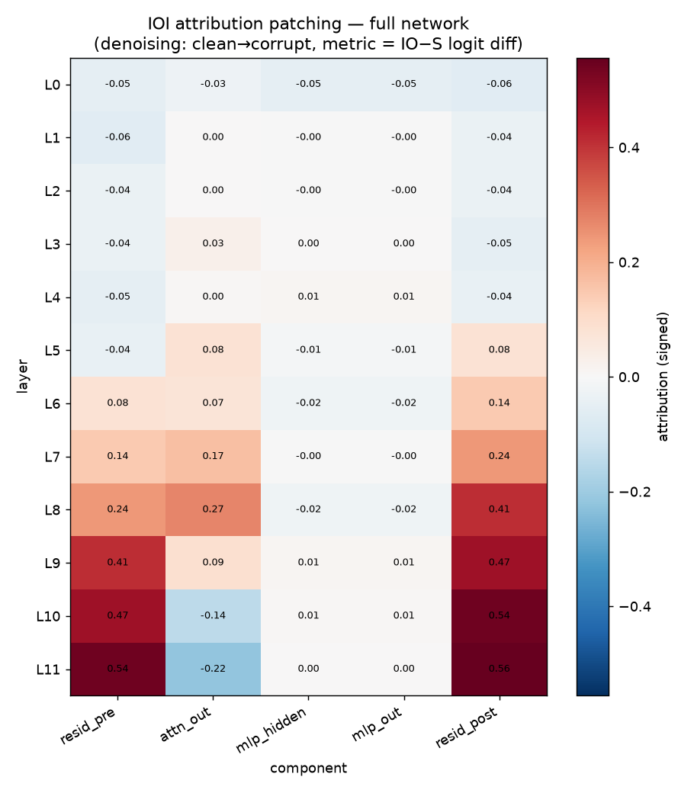
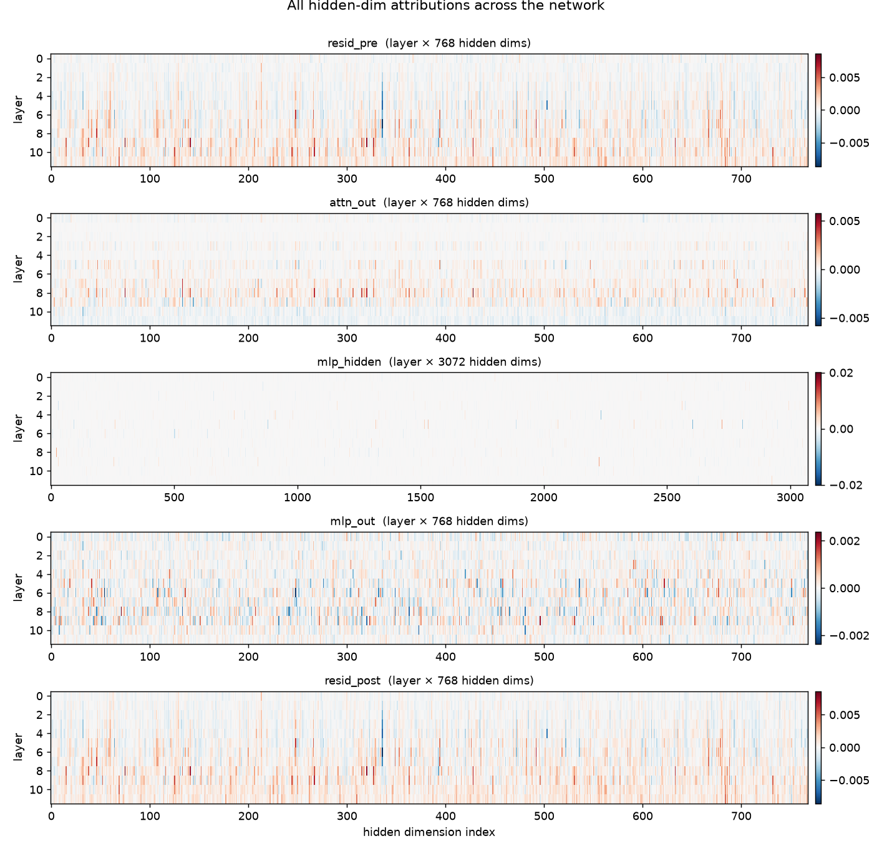

# GPT-2 IOI — full hidden-dimension attribution patching

Visualize the **whole network at once** for a single task. Instead of focusing
on a hand-picked set of MLP neurons, attention heads, or the residual stream,
this repo computes a causal attribution for **every hidden dimension at every
site** in GPT-2 and renders it as a map of the network.

- **Model:** GPT-2 small (`openai-community/gpt2`)
- **Task:** Indirect Object Identification (IOI) — *"Then, Henry and Phil … Henry
  gave a basket to →* **Phil**"
- **Data:** [`mib-bench/ioi`](https://huggingface.co/datasets/mib-bench/ioi)
  (the Mechanistic Interpretability Benchmark; a templated dataset with built-in
  counterfactuals)
- **Method:** attribution patching — a one-backward-pass linear approximation to
  activation patching, so we get an attribution for *all* activations at once
- **Paper:** Wang et al., *Interpretability in the Wild: a Circuit for IOI in
  GPT-2 small* — `paper/IOI_interpretability_in_the_wild_2211.00593.pdf`
  ([arXiv:2211.00593](https://arxiv.org/abs/2211.00593))

## Why "all hidden dims"

The classic IOI analysis tells a story about specific **heads** (name movers,
S-inhibition, induction, duplicate-token…). That requires you to know what to
look at. Here we instead read the *full* hidden state — `resid_pre`, `attn_out`,
the 3072-wide `mlp_hidden`, `mlp_out`, `resid_post`, at all 12 layers
(**73,728 hidden dims per token position**) — and let the attribution map show
where the computation is. The aggregate map should *rediscover* the circuit; the
per-dimension view shows structure that head/neuron aggregates hide.

## Method in one box

Attribution patching (Nanda 2023; Syed et al. 2023) approximates the effect of
activation patching with a first-order Taylor expansion. We use the **denoising**
direction — *"how much would the metric recover if we patched the clean
activation into the corrupt run?"*:

```
attr(a) = (a_clean − a_corrupt) · ∂ metric_corrupt / ∂ a_corrupt        (element-wise)
metric  = logit(IO) − logit(S)        at the final position
```

Cost: **1 clean forward + 1 corrupt forward + 1 corrupt backward**, total — not
per node. The corrupt input is the dataset's `abc_counterfactual` (the repeated
subject is swapped for a third name, which breaks the IOI mechanism).

## Results (n = 64, RTX 4050, ~9 s)

| metric | value |
|---|---:|
| clean logit diff (IO−S) | **+3.04** |
| corrupt (abc) logit diff | **−0.38** |
| hidden dims tracked | 73,728 |
| `per_dim.npz` on disk | 0.29 MB |

The corruption flips the model's preference (good — the mechanism is real and
breakable). The network map below recovers the known IOI story end-to-end.



- The **residual stream** lights up from L6 onward and peaks at **L9–L11** —
  where the **name-mover heads** write the IO name.
- **`attn_out`** is positive at **L7–L9** then flips **negative at L10–L11**
  (−0.14, −0.22) — the signature of **negative name movers / S-inhibition**.
- **MLPs** contribute little to IOI in aggregate (consistent with the paper),
  but the per-dimension view still surfaces a sparse set of active neurons.

**Every hidden dimension**, per component (layer × dim):



See also `results/figures/positions.png` (attribution by sentence position) and
`top_units.png` (the individual most-important hidden units). A notable finding:
per-site `|attribution|` is large (≈2.7) while the *signed* sum is small (≈0.47)
— lots of cancellation across dimensions and positions, which is precisely why
looking at all hidden dims (not just aggregates) matters.

## Run it

```bash
# 1. environment (use a CUDA torch build for your GPU)
pip install -r requirements.txt

# 2. small GPU run -> writes results/ and results/figures/
python run_small.py --n 64 --batch-size 16

# 3. or open the notebook
jupyter lab notebooks/ioi_full_activations.ipynb
```

Useful flags: `--n`, `--batch-size`, `--corruption`
(`abc_counterfactual`, `s1_io_flip_counterfactual`, `random_names_counterfactual`,
…), `--split` (`train`/`dev`/`test`).

## Layout

```
src/
  data.py            load mib-bench/ioi, build clean/corrupt batches
  sites.py           hook registry — every hidden-dim site in GPT-2
  attribution.py     denoising attribution patching + streaming reduction
  metrics.py         IO−S logit difference
  storage.py         compact on-disk format (npz + csv + manifest)
  viz.py             network map, all-hidden-dim heatmaps, top units, positions
  nnsight_inspect.py nnsight-based activation reading (inspection)
run_small.py         end-to-end GPU run
notebooks/           narrative notebook
paper/               the IOI paper (arXiv:2211.00593)
docs/STORAGE.md      the storage problem & how we handle it
docs/NNSIGHT_NOTES.md  nnsight usage + the 0.7.0 gradient caveat
results/             figures + tables (regenerate with run_small.py)
```

## Notes

- **nnsight** is used for interactive activation inspection. The attribution
  engine captures gradients with native PyTorch hooks because nnsight 0.7.0's
  `.backward()` gradient API raises `MissedProviderError` on GPT-2 — details and
  reproduction in [`docs/NNSIGHT_NOTES.md`](docs/NNSIGHT_NOTES.md). The
  attribution math is unchanged and the engine can be ported back if a later
  release fixes it.
- Attribution patching is an **approximation**. It is excellent for ranking and
  for whole-network maps, but is least accurate where activations are far from
  linear (e.g. attention softmax saturation). Verify shortlisted nodes with
  exact activation patching before strong causal claims.
- Storage strategy and the size accounting live in
  [`docs/STORAGE.md`](docs/STORAGE.md).
