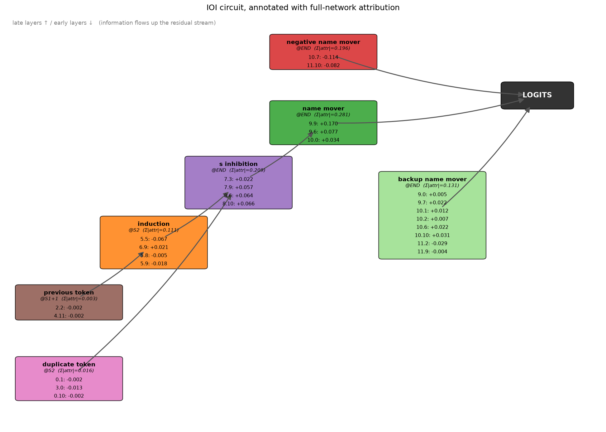
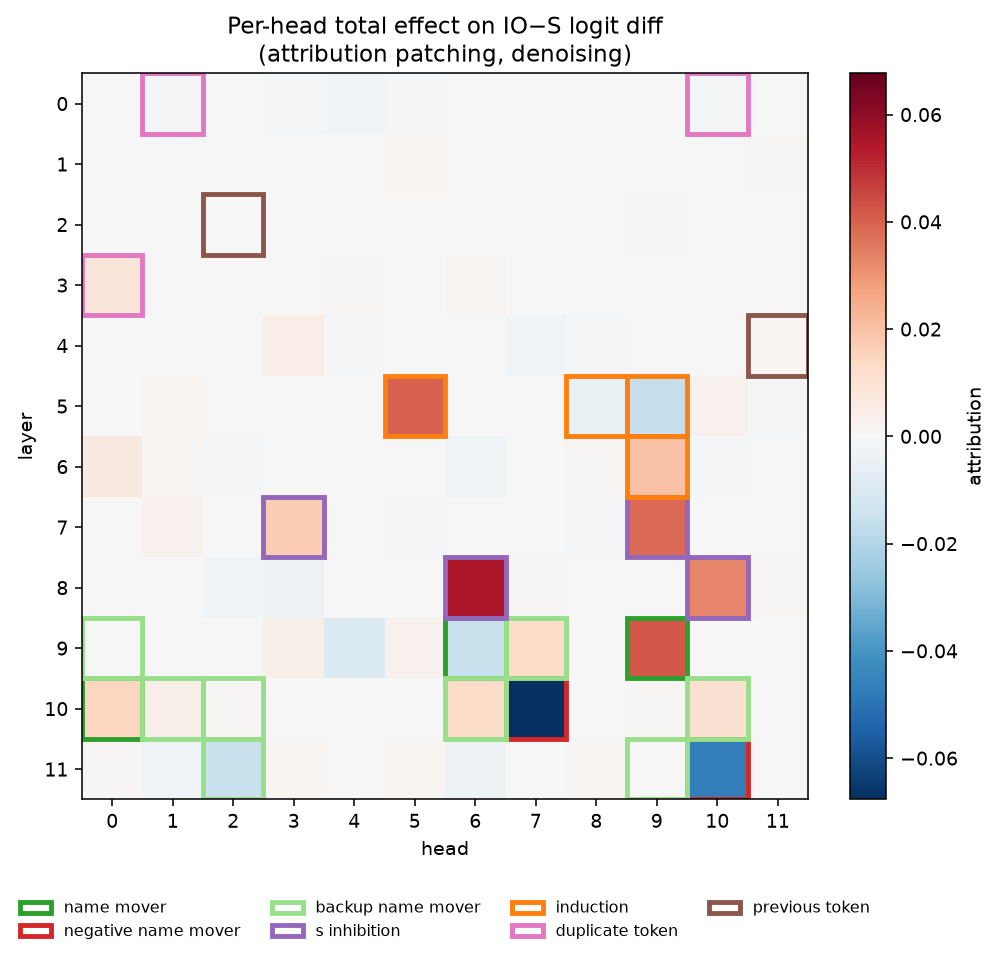
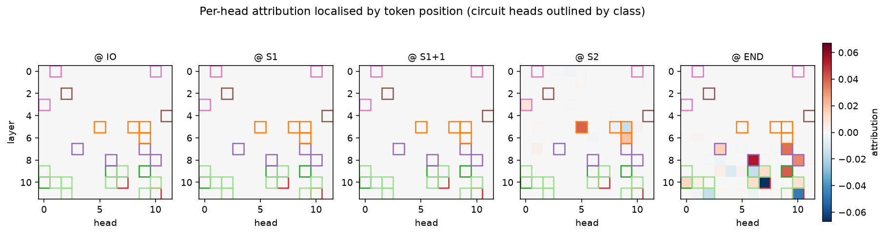

# GPT-2 IOI — full hidden-dimension attribution patching

Visualize the **whole network at once** for a task, rather than focusing on a
hand-picked set of MLP neurons, attention heads, or the residual stream. We
compute a causal attribution for **every hidden dimension at every site** in
GPT-2 small for the **Indirect Object Identification (IOI)** task, then use it to
trace the circuit, recreate the paper's figures, and look for structure *beyond*
the published circuit.

- **Model:** GPT-2 small (`openai-community/gpt2`)
- **Task / data:** IOI, [`mib-bench/ioi`](https://huggingface.co/datasets/mib-bench/ioi) (Mechanistic Interpretability Benchmark, templated with counterfactuals)
- **Method:** attribution patching (1 clean fwd + 1 corrupt fwd + 1 backward → attribution for *all* activations at once)
- **Paper:** Wang et al., *Interpretability in the Wild* — `paper/IOI_interpretability_in_the_wild_2211.00593.pdf` ([arXiv:2211.00593](https://arxiv.org/abs/2211.00593))

**→ Read [`docs/FINDINGS.md`](docs/FINDINGS.md) for the full writeup and results.**

## Headline results (RTX 4050, ~10–25 s per run)

Clean logit diff **+3.47** (paper: 3.56), GPT-2 puts **73.7%** on the correct IO.

**The circuit, traced and annotated with our attribution** (recreates paper Fig 2):



**Per-head total effect** — recovers 19/26 circuit heads in the top-26; the
position panels recover the circuit's positional structure (name movers @END,
induction @S2, …):




**Does it find circuits beyond the paper?** Yes — a consistent tail of
non-canonical heads (e.g. **9.4**, an unlisted negative-name-mover active in all
four counterfactuals), specific **MLP neurons** the paper never analyses, and the
finding that **the choice of counterfactual decides which sub-circuit is even
visible**. See [`docs/FINDINGS.md`](docs/FINDINGS.md).

## What's here

| script | what it does |
|---|---|
| `run_small.py` | component-level attribution across *all hidden dims* → network map + per-dim heatmaps |
| `run_circuit.py` | per-head + per-position attribution, direct logit attribution (Fig 3b), circuit coverage |
| `run_counterfactuals.py` | how different MIB corruptions reveal different circuit classes |
| `run_paper_figures.py` | annotated circuit diagram (Fig 2), Fig 1 prediction, attn-vs-MLP |
| `run_beyond.py` | robust non-circuit heads + top MLP neurons ("other circuits") |
| `notebooks/ioi_full_activations.ipynb` | narrative notebook (runs on GPU) |

```
src/
  data.py / positions.py   load mib-bench/ioi, build clean+corrupt batches, find IO/S1/S2/END
  sites.py / attribution.py  all-hidden-dim component engine + streaming reduction
  heads.py / dla.py        per-head & per-position attribution, direct logit attribution
  circuit.py               the paper's 26-head, 7-class circuit (ground truth)
  headviz.py / viz.py / circuitdiagram.py  figures
  analysis.py              circuit coverage + non-canonical heads
  nnsight_inspect.py       nnsight activation reading (inspection)
docs/FINDINGS.md           the writeup (start here)
docs/STORAGE.md            the storage problem & how we handle it
docs/NNSIGHT_NOTES.md      nnsight usage + the 0.7.0 gradient caveat
```

## Run it

```bash
pip install -r requirements.txt            # use a CUDA torch build for your GPU
python run_small.py        --n 64          # all-hidden-dim component map
python run_circuit.py      --n 512         # trace the head-level circuit
python run_counterfactuals.py --n 384      # corruption → visibility
python run_paper_figures.py --n 384        # recreate paper figures
python run_beyond.py        --n 384        # circuits beyond the paper
```

## Notes

- **nnsight** is used for interactive activation inspection. The attribution
  engine captures gradients with native PyTorch hooks because nnsight 0.7.0's
  `.backward()` grad API raises `MissedProviderError` on GPT-2 — details in
  [`docs/NNSIGHT_NOTES.md`](docs/NNSIGHT_NOTES.md). The attribution math is
  unchanged and the engine can be ported back if a later release fixes it.
- Attribution patching is a first-order **approximation** — great for ranking
  and whole-network maps; verify shortlisted nodes with exact patching before
  strong causal claims.
- The storage strategy (why this stays in MB, not GB) is in
  [`docs/STORAGE.md`](docs/STORAGE.md).
